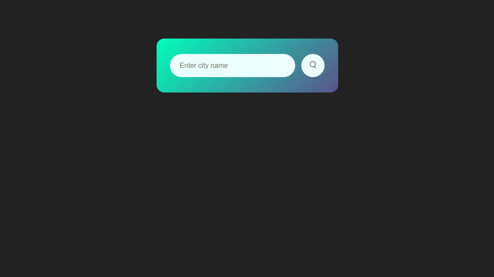
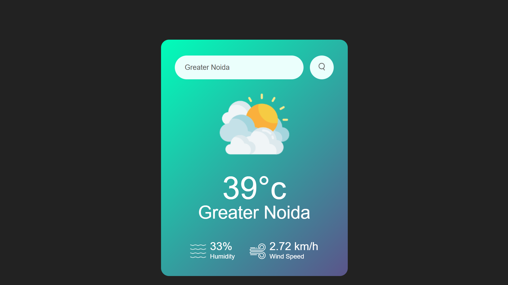
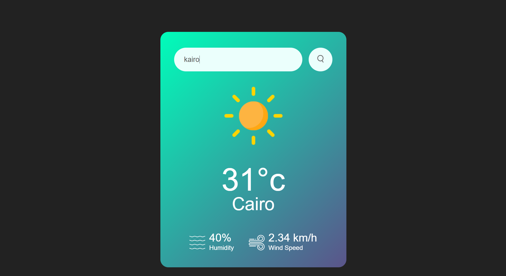
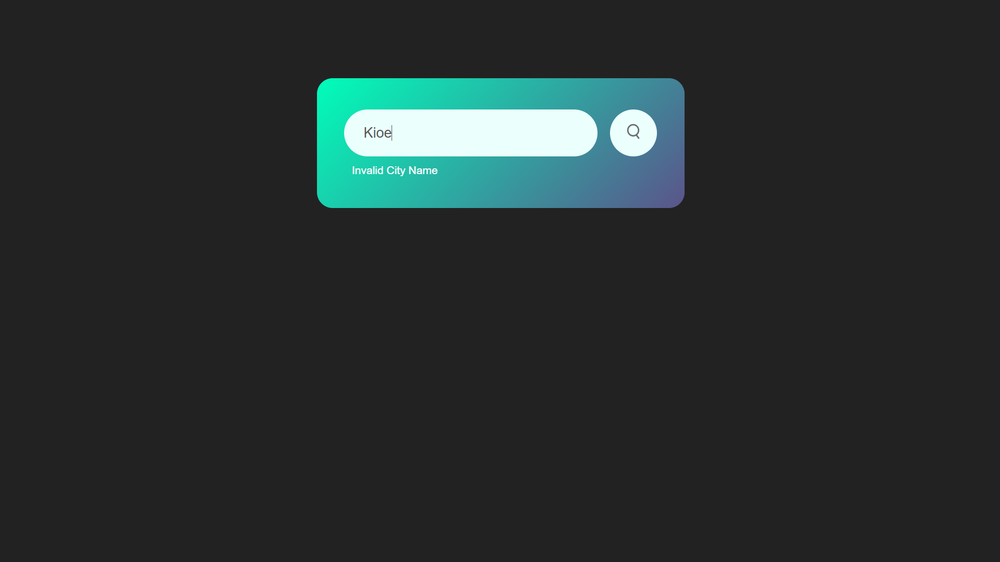

# 🌦️ Weather App

A modern, responsive **Weather Web Application** built using **HTML5, CSS3, and JavaScript** that provides **real-time weather information** for any city using the **OpenWeatherMap API**.

This project demonstrates **API integration, asynchronous JavaScript, DOM manipulation, and responsive UI design**.

---

## 🚀 Features

- 🌍 Search weather information for any city worldwide
- 🌡️ Display real-time temperature
- 💧 Display humidity percentage
- 💨 Display wind speed
- 🎯 Dynamic weather icons based on weather conditions
- ⚠️ Error handling for invalid city names
- 📱 Fully responsive design
- 🎨 Modern gradient-based UI

---

## 🛠️ Tech Stack

| Technology | Purpose |
|------------|---------|
| HTML5 | Structure of the application |
| CSS3 | Styling and responsive layout |
| JavaScript (ES6) | Application logic |
| Fetch API | Fetching weather data asynchronously |
| OpenWeatherMap API | Real-time weather information |

---

## 📂 Project Structure

```text
Weather-App/
│
├── index.html
├── style.css
├── script.js
├── images/
│   ├── clear.png
│   ├── clouds.png
│   ├── rain.png
│   ├── mist.png
│   ├── snow.png
│   └── ...
│
├── screenshots/
│   ├── home.png
│   ├── result1.png
│   ├── result2.png
│   └── error.png
│
└── README.md
```

---

## ⚙️ How It Works

1. Enter the name of a city.
2. The application sends a request to the OpenWeatherMap API.
3. The API returns the latest weather information.
4. The application dynamically updates:
   - City Name
   - Temperature
   - Humidity
   - Wind Speed
   - Weather Icon
5. Displays an error message if the city name is invalid.

---

# 📸 Application Preview

## 🏠 Home Screen



---

## 🌦️ Weather Result



---

## 🌤️ Another Weather Search



---

## ❌ Invalid City



---

## 🔑 API Setup

### Step 1

Create a free account on **OpenWeatherMap**.

### Step 2

Generate your API Key.

### Step 3

Open **script.js** and replace

```javascript
const apiKey = "YOUR_API_KEY";
```

with your own API key.

---

## ▶️ Running the Project

Clone the repository

```bash
git clone https://github.com/your-username/weather-app.git
```

Navigate into the project folder

```bash
cd weather-app
```

Open **index.html** directly in your browser or use the **Live Server** extension in Visual Studio Code.

---

## 💡 JavaScript Concepts Used

- Async/Await
- Fetch API
- Promises
- DOM Manipulation
- Event Listeners
- Template Literals
- Conditional Rendering
- Error Handling

---

## 📚 Learning Outcomes

Through this project, I learned:

- Working with REST APIs
- Handling asynchronous operations
- Parsing JSON data
- Dynamic DOM updates
- User input validation
- Responsive UI development
- Writing clean and maintainable JavaScript

---

## 🚀 Future Improvements

- 📍 Detect user's current location
- 🌤️ 5-Day Weather Forecast
- 🌙 Dark Mode
- ⭐ Favorite Cities
- 🌎 Recent Search History
- 🌡️ Temperature Unit Conversion (°C / °F)
- 📊 Weather Charts
- ⏰ Hourly Forecast

---

## 🤝 Contributing

Contributions are welcome!

Feel free to fork this repository, create a new branch, and submit a pull request.

---

## ⭐ Support

If you found this project useful, consider **starring ⭐ the repository** to support my work.
